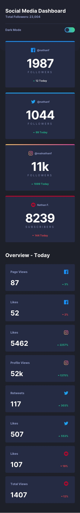

# 🌐 Frontend Mentor - Social media dashboard with theme switcher

## 📌 Overview

A responsive and dark-mode-enabled frontend project built with React and Sass, inspired by a design from [Frontend Mentor](https://www.frontendmentor.io/).

## ✨ Features

-   **📱 Fully Responsive Layout**: Supports 1000px, 800px, and 375px screen widths.
-   **🌙 Dark Mode**: Toggles background, text, and item colors.
-   **⚛️ Built with Modern Technologies**:
    -   React for UI development
    -   Sass for styling and maintainability

## 🚀 Installation & Setup

### Prerequisites

Make sure you have the following installed on your machine:

-   **Node.js** (Latest LTS version recommended)
-   **Git**

### Steps

1. **Clone the repository:**

    ```sh
    git clone https://github.com/TornikeTt/social-media-dashboard-with-theme-switcher-master.git
    ```

2. **Navigate to the project directory:**

    ```sh
    cd social-media-dashboard-with-theme-switcher-master
    ```

3. **Install dependencies:**

    ```sh
    npm install
    ```

4. **Start the development server:**

    ```sh
    npm run dev
    ```

5. **Open in browser:**
   The project will be available at:
    ```
    http://localhost:5173/
    ```

## 🛠️ Usage

-   Toggle dark mode to switch between themes.
-   Resize the browser to see different layouts in action.

## 🏗️ Technologies Used

-   **⚛️ React**: Component-based UI framework
-   **🎨 Sass**: CSS preprocessor for modular styles
-   **⚡ Vite**: Fast and optimized build tool

## 📸 Preview

<p align="center">
    
    
</p>

## 🌍 Live Demo

Check out the live version of the project here:  
[Live Demo](https://sensational-starship-7f1f7e.netlify.app/)
